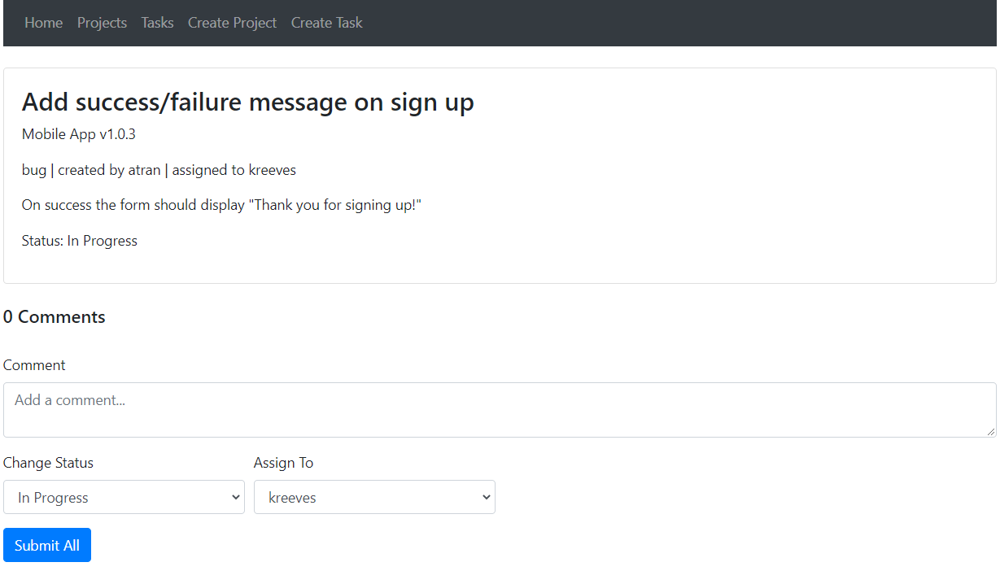

# Project Management Web App
This app simplifies project management. Here is what you can do with this app:
* Create tickets for bugs or features
* Mark tickets as "In Progress", "In QA", or "Resolved"
* Assign tickets to other users, for example developers can assign their ticket to QA and vice-versa
* Organize tickets by project/milestone
* Each user has a personalized table which only shows tickets that are assigned to them
* View all tickets in one place, and optionally filter them based on assigned user, priority, status, etc.
* Mark project's as "Complete" and automatically archive all tickets related to that project

## Setting up the project is easy
1. **$ npm install**
2. Create a .env file, and create a variable called ATLAS_URI that points to your Mongo Atlas URI
3. Start the backend server. It is currently configured to listen localhost:5000
  
**$ cd /backend**
  
**$ nodemon server**  
4. Start the react app. The web app that you visit in the browser is hosted on Port 3000 (e.g. go to localhost:3000 in your browser)
  
**$ cd /project-tracker/**
  
**$ npm start**

## Screenshots
### Create Task Form

 
### Home Page

 
### Viewing a task

 
### Projects Page

 
### Tasks Page for viewing all tasks

 

This project was bootstrapped with [Create React App](https://github.com/facebook/create-react-app).
